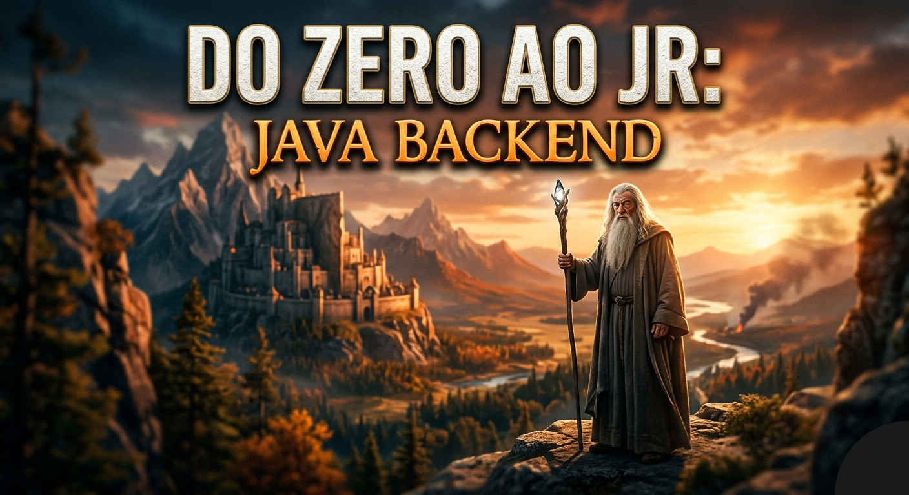

# 🚀 Do Zero ao Jr: Java Backend

  

Bem-vindo ao repositório central da série **"Do Zero ao Jr"**. Este espaço foi criado para documentar minha jornada de evolução no desenvolvimento backend com **Java** e **Spring Boot**, transformando cada desafio técnico em um registro estruturado de aprendizado.

## 📌 Sobre a Série

A proposta desta série é ir além de apenas "codar". O objetivo é documentar a construção de aplicações reais, focando em:
- **Padrões de Projeto & Arquitetura:** Implementação de DDD (Domain-Driven Design) Light.
- **Boas Práticas:** Clean Code, organização de camadas e manutenibilidade.
- **Fluxo de Trabalho Profissional:** Git Flow, Pull Requests e organização de repositórios.
- **Consolidação de Conceitos:** JPA/Hibernate, Spring Data, segurança, testes e muito mais.

---

## 🛠️ Tecnologias Utilizadas
- **Linguagem:** Java
- **Framework:** Spring Boot (Data JPA, Web)
- **Banco de Dados:** H2 / PostgreSQL / MySQL
- **Ferramentas:** Maven/Gradle, Git

## 📈 Próximos Passos
Acompanhe o repositório para ver a evolução das branches e os novos episódios que cobrirão desde regras de negócio complexas até o deploy da aplicação.

---

## 🔗 Links Úteis
*   **Aplicação Real:** [Orbit Shop](https://github.com/vavito/orbit_shop) — Onde o código deste aprendizado é implementado.

---
*Documentar é aprender duas vezes.* 🚀